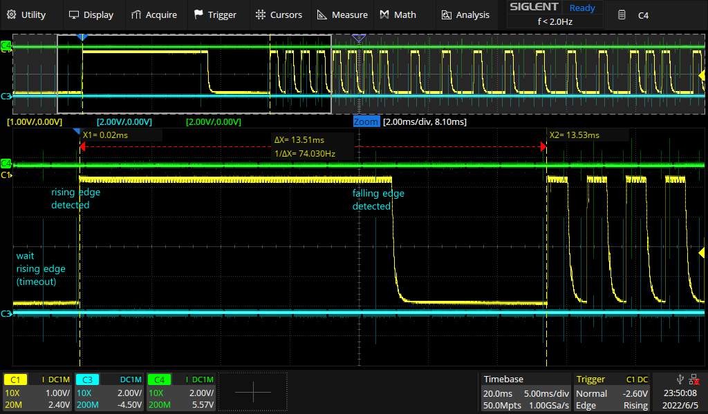
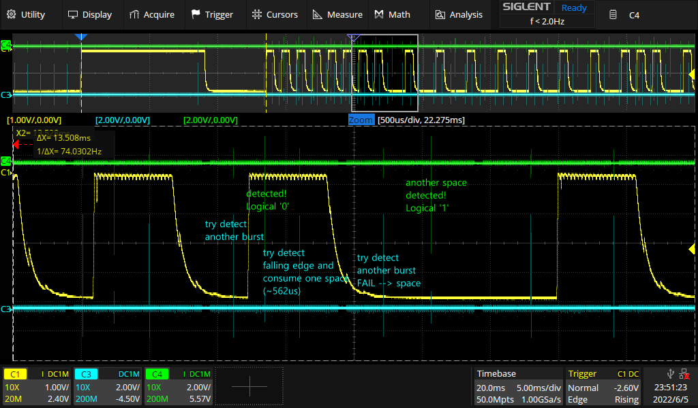

## Minimal NEC IR (38KHz) Protocol Decoder
---
Quick and dirty NEC IR protocol decoder using minimal components:
- 1 Arduino board (5V/16MHz version used here)
  - Different operating frequency may break the calibrated decoder timing!
- 1 resistor
- 1 phototransistor
- (optionally) oscilloscope to monitor raw IR signal and timing 'ticks'

Suggested circuit is as follows.


Here is the impleneted decoding scheme.
(yellow for analog IR input, blue for wait event, green for data detection)

**Note that yellow and green traces are shwon inverted!**

- Detecting a leading pulse

- Data (address / command) decoding


Monitoring UART serial port from the USB connection prints the decoded address and data.

```
55.62ms spent for stream decoding.
raw bitstream:
11111110000000011000011001111001  
Address: FE
Data   : 86
```
